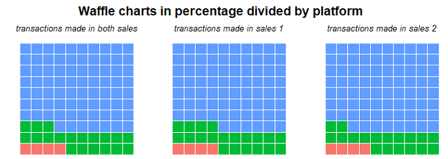
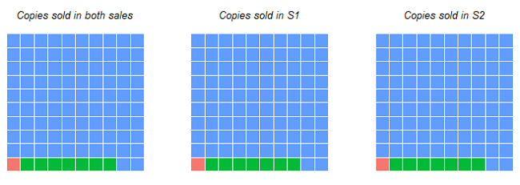
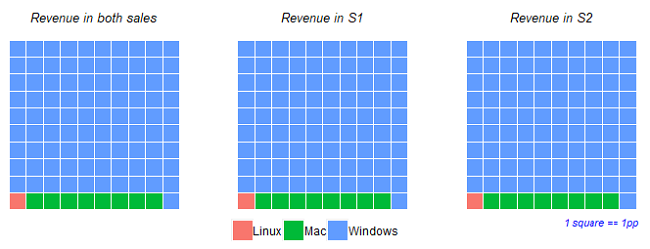

```{r setup, include=FALSE}
knitr::opts_chunk$set(echo = FALSE)

# Data wrangling
library(tidyverse)
library(janitor)
# Data loading/saving
library(readxl)
# Fro currency
library(formattable)
#for charts
library(waffle)
library(hrbrthemes)
library(ggpubr)
library(plotly)
library(ggiraph)
library(shiny)
library(kableExtra)
#custom dependencies 
source("function.R")
source("theme.R")
source("data_preparation.R")
source("waffle_chart.R")
```
## Introduction

Hi, as you probably already know my name is Wojtek, thank you for the possibility to take part in this recruitment. The task was cool, and I had a lot of fun during the analysis. My whole analysis was conducted with R, which is my primary programing language. At the end of this report you can find a link to Github with my code (for better readability). I will use “[]” syntax for in-text comments. Enjoy your reading ;)

## Basic information

  The provided data set has 19 columns and 0 missing values, which is very good information for further movements. After some basic exploratory data analysis (EDA) I decided to remove 3 columns that contained only one unique value (Package, Product(ID#), Product Name). I will assess sales of a game called "SAMPLE PRODUCT" with id 91203 from package -1. Data set contain a few useful categorical variables (nominal variable). These are Platform, Country, Region, Currency. In general we can't make order of these categories <br /> (I would risk a statement that in the game industry we can order platform because most PC developers produce games for Windows OS). 

## Sales Period and Discount

  The first task was to determinate sales period. I assume that sales periods were different in both years. The first sale took place from 2016-12-22 to 2017-01-02 (so it lasts 12 days). The second sale took place from 2017-12-21 to 2018-01-03 (so it lasts 14 days). Also some 1-day small sale took place at 2017-12-09. <br /> To illustrate and prove that I draw <b>plot 1</b>. 

```{r line_plot_sales_periods, echo=FALSE}
div(basic_line_season(sum_promo_rev, "Plot 1. Net Revenue from products on promotion in USD divided by season", "Net revenue in USD"), align = "center")
```

  In both sales peak of revenue was achieved on the 25th od December. I assume that it's because people (especially young ones) spend money from Christmas presents. It's also important to notice that sales jumps are extremely large at the beginning of the promotion regardless of the season. In the first sale, we can also see second local maximum on the 30th of December. We can see growth rates of revenues in both sales period on <b>plot 2</b>.

```{r line_plot_rev_growth_rate, echo=FALSE}
div(basic_line_season(rev_promo_rate, df_data = only_ws_data, "Plot 2. Growth rates of net revenues during sales", "Growth rates"), align = "center")
```

  It is also important to consider if distributions between two sales periods are identical [to test this <br /> I conducted Mann-Whitney U (Wilcoxon Rank Sum) test]. When comparing net revenues from winter sales we assume that they're different [H0 was rejected], but if we compare growth rates we assume that distributions are equals [No reason to reject H0].

  In microeconomics the most important thing that is responsible for product success is price. Winter sales are known for their amazing discounts. In terms of this product the discounts applied during promotion were presented in <b>table 1</b>.
```{r discount_table, echo = FALSE}
count_occurencies(sales_period, winter_sales, discount) %>%
  group_by(winter_sales) %>%
  top_n(1, wt = numb) %>%
  select(winter_sales, discount) %>%
  rename(Discount = discount, "Sales Season" = winter_sales) %>%
  knitr::kable(caption = '<b>Table 1. Discounts applied during winter sales in percents</b>')
```

  Discount during winter sales 2016/2017 was 32% and discount during winter sales 2017/2018 was 40%. This fact seems logical for most products in games industry - the older game gets, the higher discount is applied (with few exceptions [confirming the rule ;)]). Mean unit price [counted as mean of net Revenue in USD divided by net sales grouped by dates] during first winter sale including data from all countries was 15.59 USD ($22.93 w.o discount). In second sale it was equal to 12.96 USD ($21.6 w.o discount). From my personal experience I would say that this game keeps its price. 

  The next important question would be "How did the discount change during considered period"? The best answer for this question is line plot 3 which contains information about total net revenue from 1st December to  31st January. 

```{r line_plot_total_net_rev, echo=FALSE}
div(basic_line_season(sum_revenu, "Plot 3. Net Revenue from product in USD divided by season", "net revenue in USD"), align = "center")
```

  Presented data shows that discounts have a huge impact on Net Revenues. Even a small discount that took place at the begging of second season made revenues near three times bigger then the year before. <br /> To visualize these impacts I will compare money earned during winter sale with money earned without discount. It's important to notice that winter sales period is only ~19% of analysed time in season one and about ~22.5% in season two. 

```{r pie_chart_with_rev, echo=FALSE}
fig <- plot_ly()

fig <- fig %>% add_pie(data = data_pie_chart_s1, labels = ~winter_sales, values = ~sum_revenu, name = "2016/2017", domain = list(row = 0, column = 0))
fig <- fig %>% add_pie(data = data_pie_chart_s2, labels = ~winter_sales, values = ~sum_revenu, name = "2016/2018", domain = list(row = 0, column = 1))

fig <- fig %>% layout(title = "<b>Plot 4. Net Revenues grouped by winter sale</b>", showlegend = T, 
                      legend = list(title=list(text='<b>Sales option:</b>')), grid=list(rows=1, columns=2),
                      xaxis = list(showgrid = FALSE, zeroline = FALSE, showticklabels = FALSE),
                      yaxis = list(showgrid = FALSE, zeroline = FALSE, showticklabels = FALSE))

div(fig, align = "center")
```

  In first season sale (2016/2017) a little over 75% of revenue came from winter sales [pareto principle in practice ;)]. In second season (2017/2018) sales period was 2 days longer but revenues were lower by ~13 pp.

  During whole first sales period the game net total revenue (TR) was equal to over <b>1m</b> USD (<b>758k</b> from winter sale). In second sales period net TR of game was equal to <b>590k</b> USD (<b>364.5k</b> from winter sale) so TR were lower by 41.5%. Last but not the least important plot in this section will contain information about sold copies. 

```{r}
div(basic_line_season(sum_net_sales, "Plot 5. Net copies sold divided by season", "Net copies sold"), align = "center")
```

  As we may expect shape of the curve is similar to TR curve. In both years peak of sales was during the 25th od December. We also see the impact of smaller sales applied at 2017-12-09. From plot 5 alone we can't tell how many copies were sold, this information is provided in table 2 with value previously presented at pie charts. 


```{r}
count_param(date_group, sum_net_sales, sales_season, winter_sales) %>%
  mutate(count_sum_group = percent(count_sum_group),
         count_sum_ungroup = percent(count_sum_ungroup)) %>%
  rename("Sales Season" = sales_season, "Winter Sales" = winter_sales, Duration = numb, "Copies Sold" = sum_net, 
         "Perc inside group" = count_sum_group, "Perc without gruping" = count_sum_ungroup) %>%
  knitr::kable(caption = '<b>Table 2. Total copies sold during both seasons with grouping for winter sale</b>')
```

## Platform analysis

  As I wrote in the beginning data set contains a few categorical variables. It would be a waste not to use them during analysis. First, and probably the easiest [and the most obvious one for every gamer ;)] will be about the distribution between platform. To present this I created waffle charts which are a great alternative for tables and pie charts. Charts were drawn using the whole period, not only winter sales.

<center>



</center>

Waffle charts show us that over 90% of sales and revenues come from Windows platform. First line of charts is quite interesting - there were many transactions [transaction = 1 row in initial data] at Mac OS. <b>Table 3</b> contains information about revenues by platform with winter sales as a grouping variable.
```{r}
game_is_promo %>%
  group_by(sales_season, winter_sales, platform) %>%
  summarise(sum_rev = sum(net_sales_usd), sum_net_sales = sum(net_units_sold)) %>%
  mutate(rev_group_perc = sum_rev/sum(sum_rev), copy_sales_group_perc = sum_net_sales/sum(sum_net_sales)) %>%
  ungroup() %>%
  mutate(rev_group_perc = percent(rev_group_perc), copy_sales_group_perc = percent(copy_sales_group_perc)) %>%
    rename("Sales Season" = sales_season, "Winter Sales" = winter_sales, Platform = platform,
           "Copies Sold" = sum_net_sales,"Total revenues" = sum_rev, "Perc of sold copies inside group" = 	copy_sales_group_perc, 
           "Perc of TR inside group" = 	rev_group_perc) %>%
  knitr::kable(caption = '<b>Table 3. Total revenues and total copies sold during both seasons with grouping for winter sale divided by platform</b>')
```

<b> Table 3 </b> showed that during Winter sales period Windows was dominating the market even more [which isn't a surprise]. 

## Region Analysis

One of the most important categorical data inside provided data set is information about region and country. Regardless of the winter sales it's good to know which regions generate revenues and in which games sales well. It is important to notice that because of exchange differences game can sell very well in a country where currency is weak (in the data game was very cheap in PLN) [normally the differences aren't huge, and if I'm not wrong games have region lock]. Net revenues and net copies sold in percentage are shown on <b>plot 6</b> and <b> plot 7</b>

```{r}
div(draw_simple_bar(region_rev_whole_year, perc,"Plot 6. Net revenue divided by regions from both seasons" , 
                    ylab_title = "Revenue percentage"), align = "center")
div(draw_simple_bar(region_sales_whole_year, perc, "Plot 7. Net revenue divided by regions from both seasons", 
                    ylab_title = "Copies sold percentage"),  align = "center")
```

On the charts, you can see that most of the Revenues come from North America  (over 63%). Over 56% of copies were also sold in North America. Then over 21% of revenue comes from Western Europe (with nearly 23% of copies sold). These two regions are the main source of profits from this product.

## Summary and Recommendation:

- Business performance during analyzed period was pretty good, without sales game sold fairly steadily. Even a 1-day sale significantly increased sales.
- During winter sale in both year game scored peak of sales quite fast. It's important to notice that during first season sale it has 2 maximum. It would be advisable to search for the reason for this second maximum. 
- Most of the revenues come from Windows player so we should focus on them. 
- We got space to grow, if game is a success in NA it's possible to make it huge in Asia. Also if this game has multiplayer, players will recommend it to each other.

<center><b>thanks for reading and hope to hear from you soon ;) </b></center>

## Description and links:

- GitHub: https://github.com/WojciechDopieralski/game_task
- Code is commented in "calculations" file.

## Bonus 1

- The most important information would be the name of the game (with name comes type and other characteristics).  With the knowledge about type you can compare game with other of this type (or close ones). It's also very important when it comes to region comparison. Games in Asia (especially in China, South Korea and Japan) are huge (in Japan consoles are way more popular) but Asians are playing specific types of games. In the analysis sales in Asia were super low - there must be some reason for this.

- Information about taxation would be useful. It's better to sell in countries where taxes are lower, it will make net revenues higher.

- It would be great to have information about sales records from the whole year. I know that for the purpose of recruitment task it has to be cut, but for in-depth analysis longer period would be great.

- I think that idea of creating Shiny app with interactive map divided by countries would be great for this data set. I thought about it (did something like this in my past projects) but because of other responsibilities I ran out of time (as I wrote in e-mail I could start this task at 20-05-2020).

- I also thought about conducting returns analysis. It would be good to know why people return games. 

## Bonus 2

I think it was winter edition of this one: 
<center></center>
